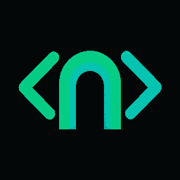

# Codex Gateway



Codex Gateway connects ChatGPT Web to one local development workspace through an OpenAI Secure MCP Tunnel. It exposes local files, guarded edits and commands, Codex task history, and installed skills without placing every internal schema in the model's default context.

> Connect ChatGPT securely to local Codex tools, project code, task history, and skills.

## Why it exists

ChatGPT cannot connect directly to `localhost`. Codex Gateway solves the local half of that connection while Secure MCP Tunnel provides the private transport:

```text
ChatGPT Web
    │ custom MCP app (called a plugin/connector in some UI versions)
    ▼
OpenAI Secure MCP Tunnel
    │ outbound connection; no public local port
    ▼
Codex Gateway
    ├─ tool_search → discover relevant local capabilities
    ├─ tool_call   → invoke one discovered capability
    ├─ tool_batch  → run independent read-only capabilities concurrently
    ├─ skill_search
    ├─ skill_read
    └─ create_goal / get_goal / update_goal / clear_goal
         ▼
One configured workspace + local Codex app-server
```

The public MCP surface contains ten stable tools:

- `gateway_info`
- `tool_search`
- `tool_call`
- `tool_batch`
- `skill_search`
- `skill_read`
- `create_goal`
- `get_goal`
- `update_goal`
- `clear_goal`

Workspace, terminal, patch, image, and Codex task schemas are returned only when a relevant search requests them. Skill search returns metadata first; instructions and supporting resources are loaded separately. Third-party provider catalogs such as XcodeBuildMCP are intentionally not mirrored.

Apple development is available without mirroring XcodeBuildMCP's full schema catalog. ChatGPT loads the installed `xcodebuildmcp-cli` skill on demand, discovers the CLI workflow with `--help` / `tools`, and runs `xcodebuildmcp` through the guarded command tool. This includes simulator and physical-device build, test, install, launch, debugging, and UI automation when supported by the installed CLI and host configuration.

When several discovered reads are independent, ChatGPT can send them together through `tool_batch`; the Gateway runs them concurrently and returns indexed results. Mutations and steps that consume earlier results stay sequential.

The four goal tools belong to ChatGPT Web, not to a Codex task. A goal is stored locally per workspace and survives new ChatGPT conversations and tunnel restarts. ChatGPT can save a checkpoint with `update_goal`, then recover it with `get_goal` in a later Web turn.

## Requirements

- macOS or Linux
- [Bun](https://bun.sh/) 1.3 or newer
- `git` and `rg`
- OpenAI `tunnel-client` available on `PATH` or at `~/.local/bin/tunnel-client`
- An OpenAI Secure MCP Tunnel ID and a runtime API key with **Tunnels Read + Use**
- ChatGPT developer mode for creating a custom MCP app

Full MCP write/modify actions currently depend on ChatGPT plan and workspace policy. See OpenAI's [developer mode and MCP apps guide](https://help.openai.com/en/articles/12584461-developer-mode-apps-and-full-mcp-connectors-in-chatgpt-beta).

## Five-minute setup

### 1. Install the gateway

```sh
git clone https://github.com/sleda/codex-gateway.git
cd codex-gateway
bun install
```

Check the local prerequisites:

```sh
bun run src/cli.mjs doctor --strict
```

### 2. Create OpenAI tunnel credentials

Create or select a tunnel in:

- [OpenAI Tunnels](https://platform.openai.com/settings/organization/tunnels)

Create a separate runtime API key in:

- [OpenAI project API keys](https://platform.openai.com/settings/organization/api-keys)

The long-running Gateway needs a runtime key, not an organization admin key. The runtime principal must be allowed to read and use the selected tunnel. The key authenticates the tunnel runtime; Codex task mutations and ChatGPT model usage remain separate operations.

### 3. Run the interactive onboarder

```sh
bun run onboard
```

The onboarder asks for:

1. The workspace directory to expose.
2. The existing `tunnel_...` ID.
3. A permission mode.
4. The runtime API key if its protected key file does not exist.

It stores a newly entered key at `~/.config/openai/codex-gateway-runtime-key` with mode `0600`, creates a managed `tunnel-client` runtime, starts it, and verifies its status. The key value is never placed in the generated MCP command.

For unattended setup:

```sh
bun run src/cli.mjs onboard \
  --workspace /absolute/path/to/project \
  --tunnel-id tunnel_YOUR_ID \
  --runtime-key-file ~/.config/openai/codex-gateway-runtime-key \
  --mode developer \
  --yes
```

Use `--dry-run` to inspect the resolved setup without writing files or starting a runtime.

### 4. Create the ChatGPT app

Open [ChatGPT Apps settings](https://chatgpt.com/#settings/Connectors). Depending on the current UI, the same feature may be labeled **App**, **Connector**, or **Plugin**.

1. Enable **Developer mode** in ChatGPT's advanced Apps settings.
2. Choose **Create app** / **Create custom MCP connector**.
3. Name it `Codex Gateway`.
4. Use this description:

   > Connect ChatGPT securely to local Codex tools, project code, task history, and skills.

5. Upload [`assets/codex-gateway-icon.png`](assets/codex-gateway-icon.png). It is a 256×256 PNG under 10 KB.
6. Select **Tunnel** as the connection type and choose the tunnel used during onboarding.
7. Select **None** for authentication. The Secure MCP Tunnel already authenticates the runtime.
8. Scan/refresh actions and finish creating the app.
9. For a trusted personal development workspace, allow all ten Gateway actions. Local Gateway policy still guards writes, commands, sensitive files, external paths, and Codex mutations independently.

Open a new ChatGPT conversation, select `Codex Gateway` from the tools menu, and try:

> Use Codex Gateway to inspect the connected workspace. Search for only the tools you need and summarize the repository before making changes.

For persistent Web work, try:

> Use Codex Gateway to create a goal for reviewing this repository. Work through the goal with the Web model, save checkpoints as you progress, and mark it complete only when verified.

The app scan should show exactly ten public actions. If it shows an older catalog, refresh the app actions or recreate the draft app while the tunnel runtime is running. An older five-action app can still discover and invoke the goal and batch tools through `tool_search` and `tool_call`, but refreshing provides the intended direct experience.

If ChatGPT reports `Session terminated`, restart the workspace runtime and wait for readiness with one command:

```sh
codex-gateway restart
```

The CLI selects `codex-gateway-<workspace-name>` from the current directory, restarts its tunnel session, and exits only after `/readyz` reports `ready`. Use `--profile <name>` when the profile has a custom name.

## Permission modes

The onboarder applies one of three local policies:

| Mode | Workspace reads | File writes | Allowlisted commands | Codex task mutations |
| --- | --- | --- | --- | --- |
| `read-only` | Yes | No | No | No |
| `developer` (default) | Yes | Yes, with confirmation | Yes | No |
| `full` | Yes | Yes, with confirmation | Yes | Yes, with confirmation |

Even in `full` mode:

- paths remain confined to the configured workspace;
- sensitive files such as `.env` remain blocked unless separately enabled;
- commands are executed without an arbitrary shell and must be allowlisted;
- workspace and Codex mutation tools require `confirmation: true`; goal checkpoints do not modify the repository;
- the outer ChatGPT workspace can apply additional action controls and confirmations.

The default command allowlist includes `xcodebuildmcp` but not raw `xcodebuild`, `xcrun`, or `simctl`. This keeps Apple workflows on the structured, help-discoverable CLI surface. Override the complete allowlist with `CODEX_GATEWAY_COMMAND_ALLOWLIST` only when a workspace requires a different policy.

For `xcodebuildmcp`, Gateway resolves a full Xcode developer directory without changing the machine-wide `xcode-select` setting. It first honors `CODEX_GATEWAY_XCODE_DEVELOPER_DIR` or a valid `DEVELOPER_DIR`, then scans `/Applications`, `~/Applications`, and `~/Downloads`, preferring a valid Xcode Beta bundle when present. The resolved directory is passed only to the child process. `gateway_info` reports the selected toolchain and readiness.

## Add another workspace

One running Gateway is bound to one real workspace root. Use a separate tunnel and runtime alias for each workspace so projects cannot accidentally cross boundaries:

```sh
bun run src/cli.mjs onboard \
  --workspace /Users/me/Projects/second-app \
  --tunnel-id tunnel_SECOND_ID \
  --runtime-key-file ~/.config/openai/codex-gateway-runtime-key \
  --alias codex-gateway-second-app \
  --profile codex-gateway-second-app \
  --mode developer \
  --yes
```

Then create a second ChatGPT app such as `Codex Gateway — Second App` and select the second tunnel. This makes the active project explicit in every ChatGPT conversation.

`CODEX_GATEWAY_ROOT` is resolved to its real path at startup. Absolute paths supplied by tools are rejected, and symlink resolution cannot escape that root.

## Runtime operations

The onboarder uses `tunnel-client runtimes connect`, which provides managed local supervision. No `nohup`, background shell, or permanent terminal window is required.

```sh
# List runtimes
tunnel-client runtimes list

# Inspect health and readiness
tunnel-client runtimes status codex-gateway-my-project

# Stop without deleting the remote tunnel
tunnel-client runtimes stop codex-gateway-my-project

# Disconnect the managed runtime
tunnel-client runtimes disconnect codex-gateway-my-project
```

Run onboarding again with the same alias and tunnel to reconnect or update its workspace command.

## Manual tunnel setup

The CLI is recommended, but the underlying setup is intentionally transparent. A tunnel profile starts Gateway over stdio with an explicit workspace:

```sh
tunnel-client init \
  --sample sample_mcp_stdio_local \
  --profile codex-gateway-my-project \
  --tunnel-id tunnel_YOUR_ID \
  --control-plane-api-key-ref file:/absolute/path/to/runtime-key \
  --health-listen-addr 127.0.0.1:0 \
  --mcp-command "/usr/bin/env CODEX_GATEWAY_ROOT=/absolute/path/to/project CODEX_GATEWAY_ENABLE_CODEX=1 CODEX_GATEWAY_ALLOW_WRITES=1 CODEX_GATEWAY_ALLOW_COMMANDS=1 bun run /absolute/path/to/codex-gateway/src/server.mjs --transport stdio"

tunnel-client doctor --profile codex-gateway-my-project --explain
tunnel-client run --profile codex-gateway-my-project
```

Keep the foreground `run` process open when using the manual path. For long-lived use, prefer the managed runtime created by `codex-gateway onboard`.

## Direct local development

Start stdio MCP without a tunnel:

```sh
CODEX_GATEWAY_ROOT=/absolute/path/to/project \
CODEX_GATEWAY_ENABLE_CODEX=1 \
bun run src/server.mjs --transport stdio
```

Or start authenticated loopback HTTP:

```sh
CODEX_GATEWAY_ROOT=/absolute/path/to/project \
CODEX_GATEWAY_TOKEN="$(openssl rand -hex 32)" \
bun run src/server.mjs --transport http --host 127.0.0.1 --port 8787
```

HTTP binds to loopback by default. Secure MCP Tunnel normally owns the stdio child process, so a second HTTP server is unnecessary for ChatGPT.

## Skills

`skill_search` discovers metadata from these roots by default:

- `<workspace>/.agents/skills`
- `~/.agents/skills`
- `$CODEX_HOME/skills` or `~/.codex/skills`
- installed Codex plugin cache

`skill_read` first loads the selected `SKILL.md`; supporting files are requested separately. Reads are size-bounded and confined to the discovered skill directory. Set `CODEX_GATEWAY_SKILL_ROOTS` to a colon-separated list only when you want to replace the defaults explicitly.

## Troubleshooting

### ChatGPT cannot find the app

- Confirm the runtime is running with `tunnel-client runtimes status <alias>`.
- Confirm ChatGPT developer mode is enabled for your account/workspace.
- Create or scan the app only while the tunnel runtime is online.
- Start a new chat and select the app for the message that needs local access.

### The app shows old tools

Gateway exposes ten public actions. Refresh actions in the ChatGPT app's management screen. If the draft still caches the older five-action schema, recreate it against the running tunnel. Until refreshed, ask ChatGPT to find `create_goal` or `tool_batch` through `tool_search` and invoke it through `tool_call`.

### `Session terminated` or disconnected streams

Check the managed runtime first:

```sh
tunnel-client runtimes status <alias> --json
```

Then run local diagnostics:

```sh
CODEX_GATEWAY_ROOT=/absolute/path/to/project bun run doctor --strict
```

Do not add a public reverse proxy as a workaround; the supported local/private path is Secure MCP Tunnel.

### ChatGPT can read but cannot edit

The local runtime was probably onboarded as `read-only`, or the ChatGPT app action is disabled. Re-run onboarding with `--mode developer` and review the app's action controls. Sensitive-file and external-path access stay disabled unless explicitly configured.

## Development and verification

```sh
bun run typecheck
bun test
bun run doctor --strict
bun run smoke:live -- /absolute/path/to/workspace
bun run build
```

The compiled binary is written to `dist/codex-gateway`. The repository also contains a Codex-local plugin manifest for users who want Gateway inside Codex itself; that plugin is optional and is not the ChatGPT custom app described above.

See [docs/architecture.md](docs/architecture.md), [SECURITY.md](SECURITY.md), and [CHANGELOG.md](CHANGELOG.md) for implementation and release details.

## License

MIT
